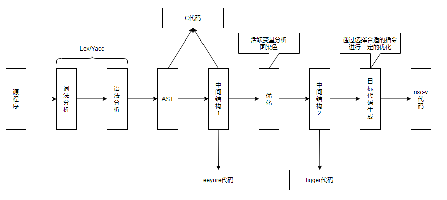
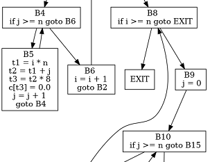
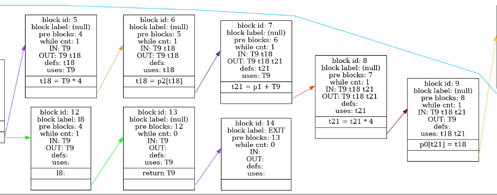

# 《编译原理》实习报告

## 1. 概述

### 1.1 基本功能

本次实习，我独立实现了一个可将 `Sysy` 语言编译到 `risc-v` 汇编的编译器，支持通过命令行参数生成两种中间表示`eeyore`和`tigger`，并且实现了一些例如使用基于活跃变量分析的图染色法进行寄存器分配，计算出编译期可以计算出的值等简单的优化策略。

### 1.2 编译器特色

对文档中给定的`Sysy`文法做了一些修改，支持了以下特性：

1. 对关系型表达式和计算型表达式不做区分，支持任何运算符的组合（只包括`Sysy`中本身就存在的运算符），和`C/C++`的表现相同。例如，下面这条语句在原版的`Sysy`文法中不被支持，但是在我的编译器中可以正确处理。

   ```c
   a = a + !(b >= c)
   ```
   
2. 支持以下对数组`B`的初始化，即可以将常数数组的值当作一个常数使用。

   ```C
   const int A[3][4] = {1,2,3};
   const int B[A[0][2]] = {A[2][3], A[1][0]};
   ```

3. 仿照`gcc/g++`编译器的处理方法处理了复杂数组初始化问题，例如下面这样的初始化根据`Sysy`的文档的内容并不能很好的解释如何处理，甚至我查阅了`C99`标准，标准中也没说清楚这样复杂的情况应该怎么办，于是我使用`gcc/g++`进行了测试，整理出一套算法，用于处理这种复杂的情况（虽然这种情况现实中不太会出现）。经多次测试，我的算法表现和`gcc/g++`编译器表现相同，详情会在实现部分介绍。

   ```C
   const int A[5][2][4][3] = {2, {}, {3}, {{3}, 4, 5}, 4, 5, 6,
                              {6, 7}, 6, {5}, {6}, {8}, 9, {10},
                              11, 1, 2, {3}, {233}, {33}, 4, 5};
   ```
   
4. 虽然最终没有做语法错误的提示，但是在代码中大量的使用了`assert`来代替错误判断，可以在需要时以此为基础完成一个错误处理流程。

### 1.3 其他项目特色

1. 在分析了三段任务之后，我发现第一阶段的任务步骤多且杂，容易出错，因此我为语法分析结束后建立的AST设计了一个将AST导出到C代码的功能，可以随时将当前的AST输出为C代码进行测试。并且写了一个脚本，用`g++`编译器编译原始代码以及从`AST`生成的代码，然后运行比较输出结果来测试表现是否一致，从而在编写`eeyore`时可以分步测试，降低了debug难度。


## 2. 设计

### 2.1 概要

#### 2.1.1 流程图



注：

- 图中的中间结构1是根据`eeyore`的文法设计的结构
- 图中的中间结构2是根绝`tigger`的文法设计的结构

#### 2.1.2 主要数据结构

编译器中和代码相关的数据结构包括包括`AST`、上一节的中间结构1、中间结构2，在我的设计中，这些结构都是由一个抽象基类加上继承自该基类的各种类型语句的派生类构成,每个结构都维护了一个枚举类型的`nodeType`。该部分的设计大家都大同小异，这里就不详细介绍了，介绍其中的两个设计：

1. 我用到的`AST`和`eeyore`的结构都是可以直接生成`C`代码的，从而便于测试。
2. 在`eeyore`的结构中，我加了一些用于标记的控制结构，包括插入注释，标记代码块（用于缩进，方便人类阅读生成的`eeyore`代码），标记循环（用于统计循环层数）等。

### 2.2 各阶段设计

#### 2.2.1 `AST` to `eeyore`

##### 问题分析

在经过`Lex/Yacc`的处理后，得到的`AST`的结构和原先的代码结构完全等价，但是并不满足`eeyore`的结构，在分析了`eeyore`的语法之后，可以大致的将这一步的转换的**核心步骤**划归为以下两类问题：

1. 符号的替换
   - 将`Sysy`中的全局变量、局部变量、函数参数的名称替换为`eeyore`中的规定样式
   - 将使用的`const`量替换为已知的值
2. 结构的转换
   - 将数组变成1维
   - 将`block`结构拆开，不再存在嵌套的`block`
   - 将`if-else`结构用`if-goto`进行替换
   - 将`while`结构用`if-goto`结构进行替换
   - 计算常量表达式
   - .....

因此，可以深度优先的访问已经构建好的`AST`，在访问过程中同时完成以上两步，这是因为深度优先遍历最终的结果就是从左到右的访问一遍叶子节点——即从上到下的遍历整个代码。

在完成了以上工作之后，`AST`的结构与`eeyore`要求的结构已经类似，便可以按部就班的根据不同节点的特性将结果转换为`eeyore`的结构，主要包括以下操作，这里过于细节且杂乱，不再赘述。

- 处理短路运算符（只是第二条的一个特殊情况）
- 将算式的中间结果用临时变量表示，并且加上使用的临时变量的声明
- ......

##### 符号表

考虑以下三点需求：

  1. 在语义分析时需要对一些已经在之前声明过的常量进行替换。
  2. 在生成`eeyore`时需要将变量名进行替换。
  3. 在生成`eeyore`时需要将多维数组替换为一维数组，因此需要存储数组的维度信息。

  在`AST`中用到的符号表结构如下：

```C
  class AbstractValNode {
  public:
      string newName;	// 替换后的新名字
      bool isConst; 	// 是否为常量
      bool isArray;	// 是否是数组
      int constVal;	// 如果是常量，这个变量用于存储该常量的值
      vector<int> arrayDims;	// 数组的维度列表
      vector<int> arrayValues;	// 如果是常量数组，这里存储常量数组的值
      // 获取常量数组中的一个值
      virtual int getConstValue(vector<int> &dims);
      // 获取常量的常量值
      virtual int getConstValue();
      // 将给定的维度值转换为对应的一维数组的维度值
      virtual int getIndex(vector<int> &dims);
  };
```

基于这个符号表，支持之前提到的以下语句是很简单的：

```
  const int A[3][4] = {1,2,3};
  const int B[A[0][2]] = {A[2][3], A[1][0]};
```

注意到这个结构是一个抽象类，这与我的设计有关。经分析可知，只有`VarDefNode`和`ArgumentNode`中会声明变量（特别地，函数形参中声明的数组的最高维度手动填了0，将多维数组的访问转换成一维数组的访问并用不到最高维度，这样是合理的），因此我直接让这两个结构继承了这个符号类，如下：

```c++
  class VarDefNode : public BaseNode, public AbstractValNode {/*......*/};
  class ArgumentNode : public BaseNode, public AbstractValNode {/*......*/};
```

##### 核心流程

一个节点的核心流程的抽象实现如下，这里`standardizing`的意义是将以该节点为根的子树“标准化”为一个符合`eeyore`结构的子树，使用了深度优先的思想。

```c++
void BaseNode::standardizing() {
    getParentSymbolTable();			// 获取父节点的符号表
    for(auto ptr: childNodes) {		// 遍历自己的子节点
        ptr->setParentPtr(this);	// 设置子节点的父节点
        updateSymbolTable(ptr);		// 根据子节点的内容更新符号表
        ptr->standardizing();		// 将子节点进行“标准化”
    }
    // 当循环结束时，该节点的子节点都标准化了
    replaceSymbols();				// 对自己进行符号替换
    equivalentlyTransform();		// 对自己进行结构变换（等价变换）
}
```

其中`getParentSymbolTable()`、`replaceSymbols()`、`equivalentlyTransform()`都是抽象函数，由派生类实现。各部分的设计思路如下

- `getParentSymbolTable()`

  在`Sysy`中，存在着不同的作用域，考虑以下事实：

  - 函数声明中的形参和变量声明是类似的，作用域为函数体
  - 作用域存在着嵌套的情况，并且内层的声明可以覆盖外层的声明
  - 当一个变量出现时，需要知道到底是哪个作用域下的变量
  - 当一个`block`结束，其作用域内的变量就不再存在，要注意正确的维护符号表

  因此，我的设计如下：

  - 每个作用域单独维护一个变量表，在深度优先访问到一个新的作用域时，首先使用`getParentSymbolTable()`获取父作用域中的符号表，然后创建这个符号表的拷贝作为自己的作用域的初始化，从而不会污染父作用域。特别地，如果是一个函数声明节点，还会在用初始化好自己的符号表后插入形参信息。
  - 对非全局非`block`节点，使用`getParentSymbolTable()`获取自己所在的作用域符号表，在需要查找变量信息时都用这个符号表来查询信息。
  - 节点中存储的实际上是`map`的指针，只在需要时创建新的符号表。
  - 在遍历子节点时，对每个子节点都应用`updateSymbolTable()`这个函数用于清空符号表，如果这个子节点不是变量声明这个函数会直接返回（默认行为）。这里是为了利用多态的特性将整个逻辑抽象化，因此单独加了一步。

  因此，在遍历到一个新的节点时，需要首先调用`getParentSymbolTable()`。

- `replaceSymbols()`

  该函数是为了实现**问题分析**中的符号替换过程。

- `equivalentlyTransform()`

  该函数是为了实现**问题分析**中的结构替换过程，进行了`block`的合并、`If`的替换、`while`的替换。

#### 2.2.2 `eeyore` to `tigger`

##### 问题分析

这一步本质是进行寄存器分配，我将核心过程拆分成了以下两步：

1. 分配寄存器，得到寄存器分配信息，从而知道一个变量是否在寄存器中以及在哪个寄存器中。在这个过程中考虑优化策略。
2. 根据分配的寄存器信息生成`tigger`结构。

这样安排的好处是便于尝试不同的寄存器分配算法，尽量将分配寄存器和生成`tigger`解耦以便于修改，这样就需要至少扫描两轮，但是问题不大。

这里采用的优化策略将在第三部分的实现中详细介绍。

##### 符号表

- `eeyore`结构中的符号表

  在将由`Sysy`生成的`AST`转换成`eeyore`的过程中，需要将多维数组转换成一维数组的形式，也需要加入一些临时变量，因此在这里设计了一个新的结构，存储了一些变量的基本信息，例如是否是临时变量、数组、全局变量等，这里不再详细介绍。

- `Tigger`结构中的符号表

  该符号表准确的是是生成`Tigger`时要用到的符号表，相比与`eeyore`中的符号表，增加了一些额外的信息，其中比较重要的部分如下：

  ```C
  struct TiggerVarInfo {
      bool isArray;		// 是否是数组
      unsigned int pos;	// 变量在栈上的起始位置
      bool inReg;			// 值是否在寄存器
      int regNum;			// 寄存器的index
      double spillCost;	// 溢出代价，用于启发式染色时选择删除的节点
      /* ...... */
  }
  ```

  其中溢出代价的计算主要考虑了变量出现次数以及变量所在的循环层数，之前已经介绍过我在`eeyore`结构中加入了用于标记循环的控制结构，因此在扫描`eeyore`结构时可以知道哪个语句在几层循环中，从而计算溢出代价。

#### 2.2.3 `tigger` to `risc-v`

##### 问题分析

该部分查表实现即可，可以做一些指令上的优化，在我的实现中，做了以下优化：

- 用移位运算替换乘以2、乘以4、除以2、除以4
- 用按位与运算替换模2

## 3. 实现

### 3.1 使用工具

- `flex & bison`：没有特别要介绍的
- `graphviz`：用于画图，用了之后发现是一个很好用的工具，但是我直到进行活跃变量分析时才使用这个工具画图，没有用这个工具画`AST`。

### 3.2 实现过程中的细节

这里介绍一些每个阶段中我认为值得介绍的细节。

#### 3.2.1 第一阶段

##### 数组的列表初始化

正如前面做提到过的，文档中并没有说清楚对于一些比较复杂（但是一般不会使用）的列表初始化应该怎么操作，这里介绍一下我通过测试`gcc/g++`拟合出的算法。

下面这个算法对一个形式诡异的初始化列表做了一个标准化。

```
输入：k维数组A，维度列表dimList，初始化列表initList
输出：rstList，如果k > 1，那么rstList的每一个元素都是列表，如果k = 1, 那么rstList中的每一个元素都是数字，且至少有一个数字（如果原先是空列表，会补一个0）

算法开始：
rstList = []
lastDim = 最后一个维度的大小
for i in range(len(initList)):
	x = initList[i]
	如果x是一个初始化列表：
   		rstList.add(x)
   	否则x应该是一个数字，需要从当前位置开始，以最低维度为单位，塞满一个完整的维度：
   		size = 该k维数组一维的大小（通过dimList计算）除以最低维度的大小
   		newList = []
   		循环直到填满size个最低维度或者遍历到了initList结尾：
   			tmpList = []
   			如果当前是一个数字，那么从当前位置开始的lastDim个元素必须是数字或者只有一个元素的列表或者已经遍历到了initList的结尾，这些元素构成了一个最低维度列表
   				tmpList.add(这个最低维度列表)
   				i += 相应的增量
   			如果当前是一个列表，这个列表直接用于填一个最低维度
   				tmpList.add(当前遍历到的这个列表)
   		// 循环结束时，这里的newList便用于初始化数组A的一个元素，newList中全是列表
   		rstList.add(newList)
```

应用上述算法的一个示例如下，可以按照以上规则观察如何填满`A[0]`。
```C
const int A[5][2][4][3] = {2, {}, {3}, {{3}, 4, 5}, 4, 5, 6,
                          {6, 7}, 6, {5}, {6}, {8}, 9, {10},
                          11, 1, 2, {3}, {233}, {33}, 4, 5};
// 使用gcc/g++编译测试，上方和下方的初始化是等价的
const int A[5][2][4][3] = {{{{2, 0, 3}, {3, 4, 5}, {4, 5, 6}, {6, 7}},
                              {{6, 5, 6}, {8}, {9, 10, 11}, {1, 2, 3}}},
                           {{{233}, {0}, {0}, {0}},
                              {{0}, {0}, {0}, {0}}},
                           {{{33}, {0}, {0}, {0}},
                              {{0}, {0}, {0}, {0}}},
                           {{{4, 5}, {0}, {0}, {0}},
                              {{0}, {0}, {0}, {0}}},
                           {{{0}, {0}, {0}, {0}},
                              {{0}, {0}, {0}, {0}}}};
      
```

##### `break`和`continue`的转换

我对该部分的设计和课上讲的不太相同，我的设计基于以下事实：`continue`和`break`所在的循环一定是`continue`和`break`的第一个类型为`while`的祖先节点，这个信息是可以知道的。

之前已经说过，在我第一阶段的处理中，结构的”等价变换“是自底向上的。当一个`while`结构需要变换到`if-goto`的时候，其子节点的结构肯定已经都处理好了，此时的`continue`和`break`都是这个`while`结构的直接子节点——那么只需要遍历一下就好了，实现起来也很方便。

##### 表达式拆分

不难看出，表达式的拆分可以使用递归的思路得到，因此我为表达式树（`AST`的一种特殊子树）设计了如下递归方法：

```C++
pair<NodePtr, NodePtrList> ExpNode::extractExp() {  /* ... */ }
```

该方法的返回值是一个`pair`，第一项是存储这个表达式节点的计算结果的变量（大部分时候都是临时变量），第二项是得到这个计算结果所需要的`eeyore`语句，包括了临时变量的声明、`eeyore`中的表达式等。

例如，如果该节点是一个二元表达式，流程如下

```C++
// 分别处理两个操作数
auto p1 = childNodes[0]->extractExp();
auto p2 = childNodes[2]->extractExp();
// 在当前所需的语句中插入计算出这两个操作数所需要的语句
stmts.insert(stmts.end(), p1.second.begin(), p1.second.end());
stmts.insert(stmts.end(), p2.second.begin(), p2.second.end());
// 创建一个新的临时变量newT，则newT = p1.first op p1.second，详细代码略
```

##### 短路运算符的处理

因为在我的文法中，支持形如`a = f(b) && c`这样的语法，因此短路运算也是需要返回值的，我的处理方案如下，以`&&`为例：

```c++
/* 处理t = A && B，这里的A和B可以看作是表达式 */
/* A，B在实际实现时也是调用extractExp()处理 */
t1 = A;
if t1 == 0 goto l1:
	t2 = B;
	t = t2 != 0;	// 如果运行到这里，a肯定是true，所以a && b = bool(b)
	goto l2:
l1:
t = 0;
l2:
```

#### 3.2.2 第二阶段

##### 活跃变量分析

在我的实现过程中，活跃变量分析实现了两个版本，第一个版本与书上相同，先计算`def`和`use`集合，然后计算每个基本块的`IN`和`OUT`集合。在这个过程中，我使用了`graphviz`画出了结果，一个示例片段如下：



但是，在之后的分析中我发现，直接计算出基本块入口出口处的活跃变量后暂时不能直接染色，因此我修改了课程上提到的方法，直接计算每一条语句前后的活跃变量，通过这个方法也可以直接发现无用的赋值语句（赋值后的变量在该语句的出口处不活跃）。因此，我修改了代码，将生成基本块的逻辑改成了为每一条语句生成一个”基本块“以复用之前写好的逻辑，修改后的一个示例片段如下（做了更多的可视化）：



在做完这一步的活跃分析之后，可以直接用每个语句的入口出口处的活跃变量集合建立冲突图，这样的做法大幅度的降低了编码的复杂度，但是效果不会差太多。

另外，为了降低编码复杂度，在分析活跃变量时，只考虑了非数组的函数参数、局部变量、临时变量。

### 3.3 优化过程细节

在我做本次lab的过程中，前后实现了两套分配及优化方案，在此均作说明。

#### 3.3.1 方案1：局部变量全部在栈上，不分配寄存器

在刚开始完成第二部分的时候，我的想法是先尽快写出一个能跑的方案出来，因此选择了将局部变量都放在栈上，暂时不做寄存器分配，但是这个方案也可以通过优化得到一个看得过去的成绩（参考排行榜的情况）。

该方案的优化核心策略是处理好临时变量。观察可知，绝大多数的情况下，一个临时变量在定义之后都会很快使用，一般来说在使用一次之后就不会再使用了（在我的设计中，处理短路运算符可能会出现对一个临时变量使用两次的情况，这个可以特判解决），但是函数调用时可能会出现一个临时变量定义后很久都没使用的情况，如下：

```
t1 = a + b
t2 = c + d
t3 + e + f
t4 = g + h
param t1, t2, t3, t4 // 简写了一下，意会即可
call xxx
```

这样的结构可以无限增加下去，在`param`之前这些临时变量都是活跃的，理论上在这里可能有很多活跃的临时变量，这是一个不太好的情况。但是如果考虑下述形式，我们就可以发现每个临时变量定义后很快被使用了，这样在同一处活跃的临时变量就不会有很多。
```
t1 = a + b
param t1
t2 = c + d
param t2
// .... 省略两个
call xxx
```

但是这个方法存在一个问题，如果是一个下面这个形式的函数调用，那么会由于`param`顺序的原因出错：

```c
f(f(a,b,c), f(c,d,e), f(r,f,d));
```

为了处理这个问题，我在栈上放了一个参数队列，每次`param`时将这个`param`的参数入队，当遇到一个函数调用时，这个函数需要几个参数，就从队列中取出几个参数给他，队列的最大长度可以在处理代码时计算出来从而分配足够的空间，从而解决了这个问题。在解决了这个问题之后，不难发现临时变量最多只需要三个就够了，因此我只为临时变量分配了寄存器，局部变量都在栈上，最后的`perf`时间是`308s`。

#### 3.3.2 方案2：将局部变量分配到寄存器中

##### 寄存器分配算法

事实上，可能由于测试用例中并没有什么局部变量很多的情况，大部分时候寄存器都是够用的，因此我前后实现的两个算法并没有太大区别，第一个算法直接按照局部变量的出现顺序分配，分配后这个局部变量就认为一直在寄存器中了，不再将他溢出到内存；第二个算法是前面说过的图染色的方法，使用简单的启发式方法进行染色。

我从方案1改到方案2后，时间从`308s`优化到了`230s`左右。

##### 针对访存次数进行优化

显然，最影响效率的还是访存次数，我针对访存次数的优化主要有以下两点：

1. 在`save/load`时选择性的操作。如果一个函数从来没有用到过一个寄存器，且这个寄存器是这个函数应该保存的，这个函数可以不保存这个寄存器，因此，可以通过统计一个函数里用了哪些寄存器，来减少函数需要保存的寄存器数目。
2. 优先分配被调用者保存的寄存器。

在完成了这部分优化之后，时间从`230s`优化到了`151s`左右，有很大幅度的优化。经过分析，主要是由于`perf`测试中有很多递归导致的。

##### 特定指令的优化

如前所述，在我的实现中，做了以下优化：

- 用移位运算替换乘以2、乘以4、除以2、除以4
- 用按位与运算替换模2

经过这些优化后，时间从`151s`优化到了`131s`左右，比我想象的幅度要大，经过分析，主要原因是`FFT`这个测试用例里有大量的除以2和模2操作导致的，因此特判这两个操作的收益非常大。

##### 优化恒真恒假的条件跳转

又优化了`4s`左右，最终时间是`127s`左右

##### 由于时间和精力原因思考了但是未尝试的优化

之后想尝试的优化主要是公共子表达式的优化，在该部分优化中，除了狭义上的公共子表达式，我们还可以将一些特殊的重复函数调用优化掉，思路如下：

可以借用函数式编程中的纯函数概念，如果一个函数是纯函数（可以简单的定义为不使用全局变量、不调用除了自身以外的其他函数的函数），两次调用这个函数的参数是一样的，且在这两次调用的间隔期间没有修改过，我们就可以把这两次函数调用也视为一个公共子表达式。

这个优化思路主要还是针对`FFT`中的，因为观察可知在`FFT`中使用这样的优化的收益非常大。


## 4. 总结

### 4.1 收获与体会

#### 4.1.1 收获

1. 一次宝贵的项目经历

2. 纸上得来终觉浅，动手做一遍lab后确实对书本上的知识理解的更深入了

3. 锻炼了对复杂的C++项目的debug能力，虽然大概率不会写比这个更复杂的C++项目了……

#### 4.1.2 学习过程中的难点

1. 个人感觉实现lab的过程和课上讲的方法还是有一点割裂，当我放弃使用课上讲的方法开始自己寻思之后反而发现明显顺利了很多

### 4.2 建议

#### 4.2.1 实习过程的建议

实习过程中发现的最明显的一个问题是第一阶段相比于后面两个阶段复杂很多，而且周期很长，过程中不便于调试。或许可以考虑将第一部分拆分成两个部分，例如先将原始的`Sysy`输出成一种便于转换成`eeyore`的标准化的结构，这个结构仍然可以是`Sysy`的语法，只是做了些变换（就和我的实现思路一样），感觉这样的话第一部分的目标会明确一些，便于开始。

